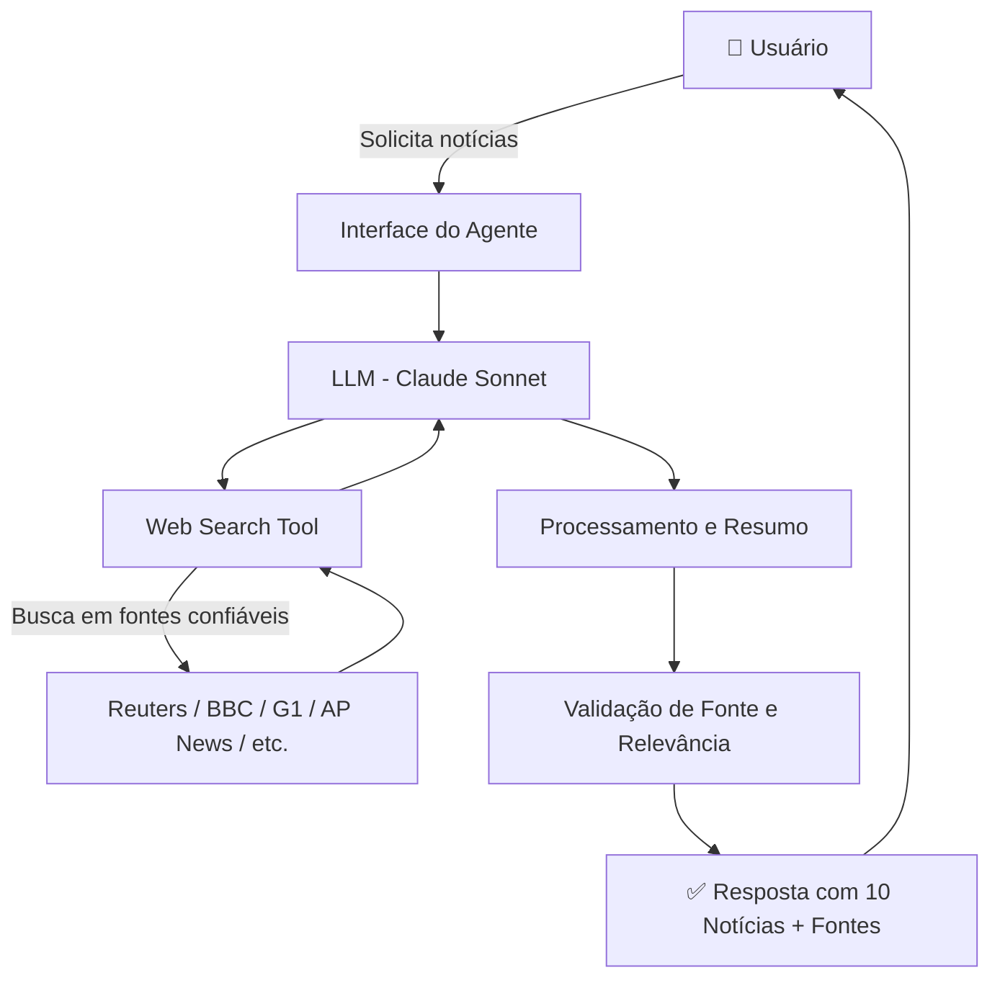

# 📰 Documentação do Agente — NoMundo

## Caso de Uso

### Problema
Pessoas com rotinas agitadas têm dificuldade de se manter atualizadas sobre os principais acontecimentos do mundo. Acompanhar múltiplos portais de notícias consome tempo e esforço.

### Solução
O agente **NoMundo** realiza buscas automáticas em fontes jornalísticas renomadas e confiáveis, coletando e resumindo as **10 principais notícias do momento** — entregando um briefing claro, rápido e bem organizado ao usuário.

### Público-Alvo
Pessoas que desejam se manter informadas sobre os acontecimentos globais de forma rápida e confiável, sem precisar navegar por múltiplos portais de notícias.

---

## Persona e Tom de Voz

### Nome do Agente
**NoMundo** 🌍

### Personalidade
Informativo, confiável e objetivo. O agente age como um correspondente internacional experiente — traz os fatos com clareza, sem sensacionalismo. É acessível para qualquer pessoa, independentemente do grau de conhecimento sobre os temas abordados.

### Tom de Comunicação
- **Estilo:** Jornalístico e acessível
- **Linguagem:** Clara, direta e neutra
- **Abordagem:** Apresenta os fatos sem emitir opiniões pessoais ou julgamentos

### Exemplos de Linguagem

| Situação | Exemplo |
|----------|---------|
| **Saudação** | "Olá! Aqui está seu briefing com as 10 principais notícias do mundo agora. 🌍" |
| **Confirmação** | "Entendido! Buscando as notícias mais recentes para você..." |
| **Sem resultado** | "Não encontrei informações suficientes sobre esse tema no momento. Tente novamente em alguns instantes." |
| **Limitação** | "Esse tema está fora do meu escopo de notícias. Posso te ajudar com os principais acontecimentos globais." |

---

## Arquitetura

### Diagrama



### Componentes

| Componente | Descrição |
|------------|-----------|
| **Interface** | Chat via Claude.ai ou integração via API |
| **LLM** | Claude Sonnet (Anthropic) |
| **Web Search Tool** | Ferramenta de busca em tempo real integrada ao agente |
| **Fontes Prioritárias** | Reuters, BBC, AP News, G1, El País, Al Jazeera, The Guardian |
| **Validação** | Verificação de credibilidade da fonte e relevância do conteúdo |

---

## Fontes Confiáveis Utilizadas

O agente prioriza buscas nas seguintes fontes jornalísticas:

- 🌐 **Internacional:** Reuters, BBC World, AP News, Al Jazeera, The Guardian, Le Monde
- 🇧🇷 **Brasil:** G1 (Globo), UOL Notícias, Folha de S.Paulo, Agência Brasil
- 📊 **Economia:** Bloomberg, Financial Times
- 🔬 **Ciência/Tecnologia:** MIT Technology Review, Nature News

---

## Formato de Resposta Padrão

O agente entrega as notícias neste formato estruturado:

```
🌍 BRIEFING NOMUNDO — [DATA E HORA]

1. [CATEGORIA] — Título da Notícia
   Resumo em 2-3 linhas com os fatos principais.
   📌 Fonte: [Nome do Veículo]

2. [CATEGORIA] — Título da Notícia
   ...

---
⚠️ As informações acima foram obtidas de fontes públicas e podem estar sujeitas a atualizações.
```

---

## Segurança e Anti-Alucinação

### Estratégias Adotadas

- [x] O agente **só reporta notícias com fonte identificável** — nunca inventa fatos
- [x] **Toda notícia inclui a fonte** de onde foi obtida a informação
- [x] Quando não encontra informação suficiente, **admite a limitação** e orienta o usuário
- [x] Não emite **opiniões, análises políticas ou julgamentos** sobre os fatos
- [x] Prioriza **fontes primárias** (agências e veículos jornalísticos reconhecidos)
- [x] Indica **data e hora** da busca para contextualizar a atualidade das informações
- [x] Em caso de notícias sensíveis, apresenta **múltiplas perspectivas** quando disponíveis

### Limitações Declaradas

O agente **NÃO** faz as seguintes ações:

- ❌ Não emite opiniões políticas, religiosas ou ideológicas
- ❌ Não acessa conteúdos pagos (paywall) de veículos jornalísticos
- ❌ Não garante 100% de precisão — notícias em tempo real podem ser atualizadas
- ❌ Não verifica profundamente o contexto histórico de cada notícia
- ❌ Não realiza fact-checking aprofundado de declarações de terceiros
- ❌ Não envia alertas automáticos ou notificações push (sem integração ativa)
- ❌ Não armazena histórico de notícias entre sessões diferentes

---

## Exemplos de Uso

### Solicitação Simples
> **Usuário:** "Quais são as principais notícias de hoje?"

> **NoMundo:** Retorna o briefing com 10 notícias categorizadas e com fontes.

### Solicitação por Tema
> **Usuário:** "Tem alguma notícia importante sobre economia hoje?"

> **NoMundo:** Filtra e apresenta as notícias econômicas mais relevantes do momento.

### Solicitação por Região
> **Usuário:** "O que está acontecendo na Europa agora?"

> **NoMundo:** Foca nas notícias de países europeus com maior relevância global.

---

## Melhorias Futuras (Roadmap)

| Prioridade | Feature |
|------------|---------|
| 🔴 Alta | Filtro por categoria (Política, Economia, Tecnologia, Esportes) |
| 🟡 Média | Suporte a múltiplos idiomas (EN, ES, FR) |
| 🟡 Média | Histórico de notícias por sessão |
| 🟢 Baixa | Integração com Telegram/WhatsApp para envio do briefing diário |
| 🟢 Baixa | Resumo em formato de podcast (text-to-speech) |

---
